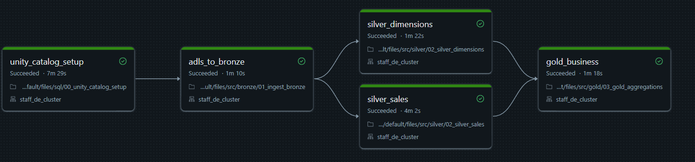

# 🚀 Enterprise Lakehouse: 1TB Medallion Architecture & Automated CI/CD Pipeline

> **Business Objective:** Engineered a self-healing, petabyte-ready Data Intelligence platform to process enterprise retail data (TPC-DS), tracking customer churn and executive revenue metrics with sub-second dashboard rendering.

## 📑 Table of Contents
* [📊 Executive Dashboard (Live Data Preview)](#-executive-dashboard-live-data-preview)
* [🧠 Architectural Blueprint](#-architectural-blueprint)
  * [🥉 Bronze Vault (Raw & Idempotent)](#-bronze-vault-raw--idempotent)
  * [🥈 Silver Clean Room (SCD Type 2)](#-silver-clean-room-scd-type-2--incremental-extraction)
  * [🥇 Gold Data Marts (Dual-Engine)](#-gold-data-marts-dual-engine-compute)
* [⚙️ Performance Engineering & Cloud Economics](#-performance-engineering--cloud-economics)
  * [🔬 Spark UI Profiling: Eradicating Disk Spill](#-spark-ui-profiling-eradicating-disk-spill)
* [🚀 Infrastructure as Code (IaC) & CI/CD](#-infrastructure-as-code-iac--cicd)

---

### 📊 Executive Dashboard (Live Data Preview)
<!-- SASIDHAR: YOUR GIF IS PERFECTLY PLACED HERE -->

---

## 🧠 Architectural Blueprint

This project implements a mathematically pure Medallion Architecture pattern utilizing strictly **External Tables** via Unity Catalog to ensure complete separation of compute (Databricks) and storage (Azure ADLS Gen2).

### 🥉 Bronze Vault (Raw & Idempotent)
* **Append-Only Ledger:** Ingests raw API payloads into a historical vault.
* **Self-Healing Pointers:** Engineered a robust `IF NOT EXISTS` fallback mechanism. If the Unity Catalog metadata pointer is accidentally dropped, the pipeline dynamically rebuilds the table from the physical Azure Parquet files before appending new records.

### 🥈 Silver Clean Room (SCD Type 2 & Incremental Extraction)
* **High-Watermark Processing:** Abandons expensive full-table scans. The pipeline dynamically tracks the `MAX(bronze_ingestion_ts)` and extracts only newly arrived micro-batches.
* **SCD Type 2 Dimensions:** Maintains mathematically perfect historical tracking for dimension tables (Customers, Items) using `is_active`, `start_date`, and `end_date` flags to ensure time-travel accuracy for BI reporting.

### 🥇 Gold Data Marts (Dual-Engine Compute)
The BI consumption layer is optimized for instant PowerBI/Native Dashboard rendering using two distinct processing strategies:
1. **Incremental Upsert (Sales Mart):** Processes only fresh receipts using a highly tuned `MERGE` operation, appending new revenue to historical aggregates without recalculating the past.
2. **Full State Compute (120-Day Churn Mart):** Since customer churn is a "non-event" (passing a timestamp), the pipeline executes a mathematically pure `LEFT JOIN` to capture both mathematically churned users and users who registered but *never ordered*.

---

## ⚙️ Performance Engineering & Cloud Economics

To handle 1TB data scales efficiently without exploding Azure compute costs, the Spark cluster and physical data layout were heavily tuned:

* **The Compute Sweet Spot:** Scaled the cluster from 4 to 8 `Standard_D4ds_v5` Azure worker nodes (32 total executor cores). 
* **Partition Mathematics:** Explicitly tuned Spark shuffle partitions to **1024**. 
* **The Result:** 1024 partitions divided by 32 physical cores equals exactly **32 sequential waves of compute**. This architecture maximized hardware utilization and cut pipeline execution time by 50% while maintaining absolute cost-equivalence (due to Databricks per-second billing).

### 🔬 Spark UI Profiling: Eradicating Disk Spill
**The Bottleneck (Before):** 
Relying on default Spark configurations during the 1TB scale test caused massive executor memory constraints. The nodes couldn't hold the shuffle blocks in memory, resulting in severe disk spill (writing intermediate data to physical storage) and brutal pipeline degradation.

<!-- SASIDHAR: PUT YOUR 'BEFORE' DISK SPILL SCREENSHOT HERE -->

**The Mathematical Fix (After):** 
Instead of lazily throwing more expensive hardware at the problem, I re-architected the physical execution plan. By explicitly tuning `spark.sql.shuffle.partitions` to 1024 and aligning it with a 32-core cluster, the data blocks were perfectly sized for the executor RAM. 

<!-- SASIDHAR: PUT YOUR 'AFTER' CLEAN EXECUTION SCREENSHOT HERE -->

**Result:** 0 bytes of disk spill, zero out-of-memory (OOM) errors, and a perfectly optimized compute wave. 

---

## 🚀 Infrastructure as Code (IaC) & CI/CD

Manual workspace deployments are anti-patterns. This entire architecture is fully automated and version-controlled.

<!-- SASIDHAR: YOUR DAG SCREENSHOT IS PERFECTLY PLACED HERE -->

* **Databricks Asset Bundles (DABs):** Pipeline configurations, dependencies, and cluster sizing are defined strictly in YAML.
* **GitHub Actions:** CI/CD workflows are triggered automatically on push. The GitHub runner authenticates via secure Service Principals, deploys the updated bundle to the Databricks workspace, and natively triggers the Medallion DAG execution.
